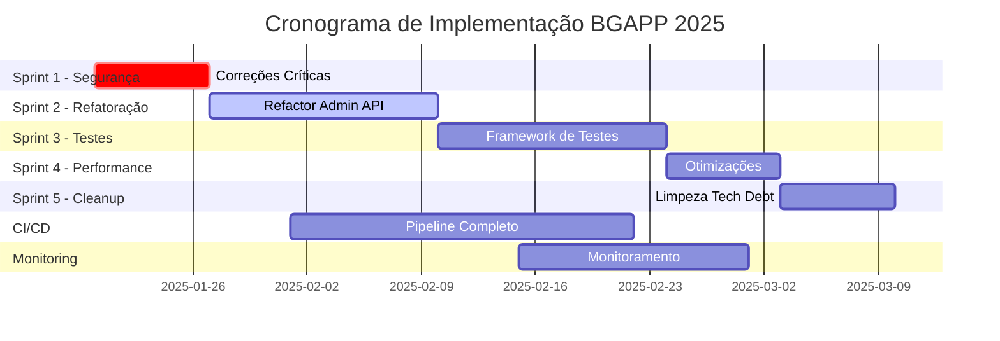

# 🗂️ PLANO DE TAREFAS GIT - BGAPP 2025
**Projeto:** BGAPP Marine Angola  
**Data de Criação:** Janeiro 2025  
**Baseado em:** Relatório de Auditoria de Código  

---

## 📋 ESTRUTURA DE BRANCHES

```
main
├── develop
│   ├── feature/security-fixes-critical    [SPRINT 1]
│   ├── feature/refactor-admin-api        [SPRINT 2]  
│   ├── feature/testing-framework         [SPRINT 3]
│   ├── feature/performance-optimization  [SPRINT 4]
│   └── feature/cleanup-tech-debt        [SPRINT 5]
└── hotfix/
    └── hotfix/security-vulnerabilities   [IMEDIATO]
```

---

## 🚨 SPRINT 1: CORREÇÕES CRÍTICAS DE SEGURANÇA
**Branch:** `feature/security-fixes-critical`  
**Duração:** 1 semana  
**Prioridade:** 🔴 CRÍTICA  

### Issues para criar no GitHub:

#### Issue #1: Habilitar Validações de Build
```markdown
**Título:** Enable TypeScript and ESLint validations in production build
**Labels:** bug, security, critical
**Milestone:** Security Sprint
**Assignee:** DevOps Team

**Descrição:**
Currently, TypeScript errors and ESLint warnings are being ignored in production builds.

**Tarefas:**
- [ ] Remove `ignoreBuildErrors: true` from next.config.js
- [ ] Remove `ignoreDuringBuilds: true` from next.config.js  
- [ ] Fix all TypeScript errors
- [ ] Fix all ESLint warnings
- [ ] Add pre-commit hooks to prevent future issues

**Acceptance Criteria:**
- Build deve falhar se houver erros TypeScript
- Build deve falhar se houver warnings ESLint críticos
- CI/CD pipeline validando qualidade do código
```

#### Issue #2: Remover Console.logs de Produção
```markdown
**Título:** Remove all console.log statements from production code
**Labels:** bug, performance, security
**Milestone:** Security Sprint
**Assignee:** Frontend Team

**Descrição:**
88 console.log statements found in production code affecting performance and potentially leaking sensitive information.

**Arquivos Afetados:**
- admin-dashboard/src/lib/api.ts (19 ocorrências)
- admin-dashboard/src/components/dashboard/services-integration-cloudflare.tsx (7)
- admin-dashboard/src/lib/api-cloudflare.ts (7)
- [... outros 17 arquivos]

**Tarefas:**
- [ ] Implementar logger service apropriado
- [ ] Substituir console.log por logger.debug
- [ ] Configurar níveis de log por ambiente
- [ ] Adicionar regra ESLint para prevenir console.log

**Acceptance Criteria:**
- Zero console.log em produção
- Sistema de logging configurado
- Logs apenas em desenvolvimento/debug
```

#### Issue #3: Corrigir Imports de Segurança
```markdown
**Título:** Fix commented security imports in Cloudflare Workers
**Labels:** bug, security, critical
**Milestone:** Security Sprint  
**Assignee:** Backend Team

**Descrição:**
Security imports are commented out in workers, creating vulnerabilities.

**Arquivos:**
- workers/admin-api-worker.js (linha 24)
- workers/cors-security-enhanced.js
- Todos os workers files

**Tarefas:**
- [ ] Descomentar import de cors-security-enhanced.js
- [ ] Validar SECURITY_ENABLED sempre true
- [ ] Implementar fallback seguro
- [ ] Adicionar testes de segurança

**Acceptance Criteria:**
- Todos imports de segurança ativos
- CORS configurado corretamente
- Rate limiting funcionando
```

#### Issue #4: Sanitizar Secrets e Credenciais
```markdown
**Título:** Remove hardcoded secrets and implement secure credential management
**Labels:** security, critical
**Milestone:** Security Sprint
**Assignee:** Security Team

**Descrição:**
20 files with potential exposed secrets detected.

**Tarefas:**
- [ ] Scan completo com ferramentas de segurança
- [ ] Mover secrets para variáveis de ambiente
- [ ] Implementar gestão segura de credenciais
- [ ] Rotacionar todas as keys expostas
- [ ] Adicionar .gitignore apropriado

**Acceptance Criteria:**
- Zero secrets em código
- Todas credenciais em env vars
- Secrets manager configurado
```

---

## 🔧 SPRINT 2: REFATORAÇÃO DO ADMIN API
**Branch:** `feature/refactor-admin-api`  
**Duração:** 2 semanas  
**Prioridade:** 🟡 ALTA  

### Issues:

#### Issue #5: Refatorar admin_api.py Monolítico
```markdown
**Título:** Refactor monolithic admin_api.py (8936 lines) into modular structure
**Labels:** refactor, tech-debt, enhancement
**Milestone:** Refactoring Sprint
**Assignee:** Backend Team

**Descrição:**
admin_api.py has grown to 8936 lines, making it unmaintainable.

**Nova Estrutura Proposta:**
src/bgapp/api/
├── admin/
│   ├── __init__.py
│   ├── auth.py
│   ├── dashboard.py
│   ├── services.py
│   ├── monitoring.py
│   ├── ml_endpoints.py
│   └── data_endpoints.py
├── core/
│   ├── dependencies.py
│   ├── middleware.py
│   └── exceptions.py
└── routers/
    ├── admin_router.py
    └── public_router.py

**Tarefas:**
- [ ] Criar nova estrutura de diretórios
- [ ] Extrair endpoints de autenticação
- [ ] Extrair endpoints de dashboard
- [ ] Extrair endpoints de serviços
- [ ] Extrair endpoints de ML
- [ ] Implementar routers modulares
- [ ] Adicionar testes unitários
- [ ] Documentar nova arquitetura

**Acceptance Criteria:**
- Nenhum arquivo > 500 linhas
- 100% backward compatibility
- Testes passando
- Performance mantida ou melhorada
```

#### Issue #6: Implementar Repository Pattern
```markdown
**Título:** Implement Repository Pattern for data access layer
**Labels:** enhancement, architecture
**Milestone:** Refactoring Sprint
**Assignee:** Backend Team

**Descrição:**
Separate business logic from data access using Repository Pattern.

**Tarefas:**
- [ ] Criar interfaces de repositório
- [ ] Implementar repositórios concretos
- [ ] Adicionar camada de serviço
- [ ] Implementar Unit of Work
- [ ] Adicionar cache layer

**Acceptance Criteria:**
- Data access totalmente abstraído
- Testabilidade melhorada
- Cache implementado
```

---

## 🧪 SPRINT 3: FRAMEWORK DE TESTES
**Branch:** `feature/testing-framework`  
**Duração:** 2 semanas  
**Prioridade:** 🟡 ALTA  

### Issues:

#### Issue #7: Implementar Jest para Frontend
```markdown
**Título:** Setup Jest testing framework for React/Next.js frontend
**Labels:** testing, enhancement
**Milestone:** Testing Sprint
**Assignee:** Frontend Team

**Descrição:**
No unit tests for React components currently exist.

**Tarefas:**
- [ ] Configurar Jest e React Testing Library
- [ ] Criar testes para componentes críticos
- [ ] Implementar testes de hooks
- [ ] Adicionar testes de integração
- [ ] Configurar coverage reports
- [ ] Integrar com CI/CD

**Meta de Cobertura:**
- Componentes críticos: 90%
- Hooks: 80%
- Utils: 100%
- Overall: 70%

**Acceptance Criteria:**
- Jest configurado e funcionando
- Coverage > 70%
- CI/CD rodando testes
```

#### Issue #8: Implementar Pytest para Backend
```markdown
**Título:** Setup Pytest framework for Python/FastAPI backend
**Labels:** testing, enhancement
**Milestone:** Testing Sprint
**Assignee:** Backend Team

**Descrição:**
Limited test coverage for backend APIs.

**Tarefas:**
- [ ] Configurar Pytest e fixtures
- [ ] Criar testes unitários para services
- [ ] Implementar testes de integração para APIs
- [ ] Adicionar testes para ML models
- [ ] Configurar mocking para externos
- [ ] Setup coverage reports

**Meta de Cobertura:**
- APIs críticas: 90%
- Services: 80%
- ML models: 70%
- Overall: 75%

**Acceptance Criteria:**
- Pytest configurado
- Coverage > 75%
- Testes rodando em CI/CD
```

---

## ⚡ SPRINT 4: OTIMIZAÇÃO DE PERFORMANCE
**Branch:** `feature/performance-optimization`  
**Duração:** 1 semana  
**Prioridade:** 🟢 MÉDIA  

### Issues:

#### Issue #9: Otimizar Bundle Size do Frontend
```markdown
**Título:** Optimize frontend bundle size and implement code splitting
**Labels:** performance, enhancement
**Milestone:** Performance Sprint
**Assignee:** Frontend Team

**Descrição:**
Frontend bundle needs optimization for better performance.

**Tarefas:**
- [ ] Analisar bundle com webpack-bundle-analyzer
- [ ] Implementar code splitting por rota
- [ ] Lazy loading de componentes pesados
- [ ] Tree shaking agressivo
- [ ] Otimizar imports
- [ ] Comprimir assets

**Métricas Target:**
- Bundle size < 200KB (inicial)
- First Contentful Paint < 1.5s
- Time to Interactive < 3s

**Acceptance Criteria:**
- Bundle reduzido em 40%
- Lighthouse score > 90
- Core Web Vitals verde
```

#### Issue #10: Otimizar Queries do Database
```markdown
**Título:** Optimize database queries and implement query caching
**Labels:** performance, backend
**Milestone:** Performance Sprint
**Assignee:** Backend Team

**Descrição:**
Some database queries are not optimized.

**Tarefas:**
- [ ] Identificar queries lentas
- [ ] Adicionar índices apropriados
- [ ] Implementar query caching
- [ ] Otimizar N+1 queries
- [ ] Adicionar connection pooling
- [ ] Implementar read replicas

**Métricas Target:**
- Query time p95 < 100ms
- API response time < 200ms

**Acceptance Criteria:**
- Todas queries < 100ms
- Cache hit rate > 80%
```

---

## 🧹 SPRINT 5: LIMPEZA DE DÉBITO TÉCNICO
**Branch:** `feature/cleanup-tech-debt`  
**Duração:** 1 semana  
**Prioridade:** 🟢 MÉDIA  

### Issues:

#### Issue #11: Limpar Estrutura de Diretórios
```markdown
**Título:** Clean up directory structure and remove unnecessary files
**Labels:** tech-debt, cleanup
**Milestone:** Cleanup Sprint
**Assignee:** Full Team

**Descrição:**
Project has accumulated unnecessary files and complex directory structure.

**Tarefas:**
- [ ] Remover pasta _organization/backups
- [ ] Consolidar arquivos de configuração
- [ ] Organizar imports e exports
- [ ] Remover código morto
- [ ] Atualizar .gitignore
- [ ] Documentar nova estrutura

**Arquivos para Remover:**
- _organization/backups/* (1115 arquivos)
- _organization/temp/* (559 arquivos)
- Código comentado
- Arquivos .backup

**Acceptance Criteria:**
- Redução de 50% em arquivos desnecessários
- Estrutura clara e documentada
```

#### Issue #12: Resolver TODOs e FIXMEs
```markdown
**Título:** Resolve all TODO and FIXME comments in codebase
**Labels:** tech-debt, cleanup
**Milestone:** Cleanup Sprint
**Assignee:** Full Team

**Descrição:**
13 TODO/FIXME comments found that need resolution.

**Localização:**
- src/bgapp/workflows/scientific_workflow_manager.py (1)
- src/bgapp/middleware/audit_middleware.py (2)
- src/bgapp/ml/retention_monitoring.py (1)
- [... outros 5 arquivos]

**Tarefas:**
- [ ] Listar todos TODOs/FIXMEs
- [ ] Priorizar por impacto
- [ ] Resolver ou criar issues específicas
- [ ] Adicionar regra para prevenir novos

**Acceptance Criteria:**
- Zero TODOs em código
- Issues criadas para trabalho futuro
```

---

## 🚀 CI/CD E AUTOMAÇÃO

### Issue #13: Implementar GitHub Actions Pipeline Completo
```markdown
**Título:** Setup complete CI/CD pipeline with GitHub Actions
**Labels:** devops, automation, enhancement
**Milestone:** DevOps Sprint
**Assignee:** DevOps Team

**Descrição:**
Implement comprehensive CI/CD pipeline for automated testing and deployment.

**Workflow Proposto:**
.github/workflows/
├── ci.yml           # Continuous Integration
├── cd-staging.yml   # Deploy to Staging
├── cd-prod.yml      # Deploy to Production
├── security.yml     # Security Scanning
└── quality.yml      # Code Quality Checks

**Tarefas:**
- [ ] Criar workflow de CI com testes
- [ ] Implementar quality gates
- [ ] Setup deploy automático para staging
- [ ] Configurar aprovação manual para prod
- [ ] Adicionar security scanning
- [ ] Implementar rollback automático
- [ ] Configurar notificações

**Acceptance Criteria:**
- Todos PRs passam por CI
- Deploy automático funcionando
- Rollback em < 2 minutos
```

---

## 📊 MÉTRICAS E MONITORAMENTO

### Issue #14: Implementar Monitoramento Avançado
```markdown
**Título:** Implement advanced monitoring with APM and error tracking
**Labels:** monitoring, observability
**Milestone:** Monitoring Sprint
**Assignee:** DevOps Team

**Descrição:**
Current monitoring is basic and needs enhancement.

**Ferramentas Propostas:**
- Sentry para error tracking
- Datadog/New Relic para APM
- Grafana para dashboards
- Prometheus para métricas

**Tarefas:**
- [ ] Configurar Sentry
- [ ] Implementar APM
- [ ] Criar dashboards customizados
- [ ] Setup alertas inteligentes
- [ ] Implementar distributed tracing
- [ ] Configurar log aggregation

**Acceptance Criteria:**
- 100% de erros capturados
- Dashboards em tempo real
- Alertas configurados
```

---

## 🗓️ CRONOGRAMA PROPOSTO



---

## 📈 KPIs PARA ACOMPANHAMENTO

### Métricas de Qualidade
- **Cobertura de Testes:** 0% → 70% (3 meses)
- **Complexidade Ciclomática:** 8.3 → 5.0
- **Duplicação de Código:** 15% → 5%
- **Débito Técnico:** Alto → Baixo

### Métricas de Performance
- **Build Time:** Current → < 3 min
- **Deploy Time:** Current → < 5 min
- **API Response Time:** 200ms → 150ms
- **Bundle Size:** Current → -40%

### Métricas de Segurança
- **Vulnerabilidades Críticas:** ? → 0
- **Security Score:** Current → A+
- **Secrets Expostos:** 20 → 0

---

## 🏷️ LABELS SUGERIDAS PARA GITHUB

```yaml
# Prioridade
- critical (vermelho)
- high (laranja)
- medium (amarelo)
- low (verde)

# Tipo
- bug (vermelho)
- enhancement (azul)
- feature (roxo)
- refactor (ciano)

# Área
- frontend (azul claro)
- backend (verde escuro)
- devops (cinza)
- security (vermelho escuro)

# Status
- in-progress (amarelo)
- blocked (vermelho)
- review-needed (roxo)
- ready-to-merge (verde)

# Sprint
- sprint-1-security
- sprint-2-refactor
- sprint-3-testing
- sprint-4-performance
- sprint-5-cleanup
```

---

## 🎯 DEFINIÇÃO DE PRONTO (DoD)

Para cada issue ser considerada completa:

✅ Código implementado e testado  
✅ Testes unitários escritos e passando  
✅ Code review aprovado  
✅ Documentação atualizada  
✅ Sem warnings de lint/build  
✅ Performance validada  
✅ Security check passed  
✅ Merged to develop  

---

## 📝 TEMPLATE DE ISSUE

```markdown
## 📋 Descrição
[Descrição clara do problema ou feature]

## 🎯 Objetivo
[O que queremos alcançar]

## ✅ Tarefas
- [ ] Tarefa 1
- [ ] Tarefa 2
- [ ] Tarefa 3

## 🔍 Acceptance Criteria
- Critério 1
- Critério 2
- Critério 3

## 📊 Métricas de Sucesso
[Como mediremos o sucesso]

## 🔗 Relacionado
- Issue #XX
- PR #YY

## 📚 Documentação
[Links relevantes]

## 🏷️ Labels
[Labels aplicáveis]
```

---

## 🚦 PRÓXIMOS PASSOS IMEDIATOS

1. **Criar branch `hotfix/security-vulnerabilities`**
   ```bash
   git checkout -b hotfix/security-vulnerabilities
   ```

2. **Criar todas as issues no GitHub**
   - Usar os templates fornecidos
   - Adicionar labels apropriadas
   - Assign para equipes

3. **Configurar Project Board**
   - Criar colunas: Backlog, Sprint, In Progress, Review, Done
   - Adicionar todas issues
   - Priorizar por criticidade

4. **Iniciar Sprint 1 - Segurança**
   - Daily standups
   - Sprint review após 1 semana
   - Retrospectiva

5. **Comunicar plano à equipe**
   - Reunião de kick-off
   - Documentar decisões
   - Estabelecer rituais

---

**Documento criado por:** Sistema de Auditoria BGAPP  
**Data:** Janeiro 2025  
**Versão:** 1.0.0  

---

*Este plano deve ser revisado e ajustado conforme necessário durante a execução. Mantenha o documento atualizado com o progresso real.*