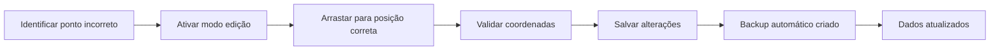

# Sistema de Edição QGIS Fisheries - Angola

## 📋 Visão Geral

Sistema completo de edição interativa para correção de pontos mal posicionados nas infraestruturas pesqueiras de Angola. Permite edição drag-and-drop diretamente no mapa com validação, backup automático e sincronização em tempo real.

## 🎯 Funcionalidades Implementadas

### ✅ Frontend (qgis_fisheries.html)
- **Modo de Edição Toggle**: Ativar/desativar edição com um clique
- **Drag & Drop**: Arraste pontos diretamente no mapa
- **Validação em Tempo Real**: Verificação automática de coordenadas
- **Feedback Visual**: 
  - Animação pulsante durante edição
  - Marcadores verdes para pontos editados
  - Contador de alterações pendentes
- **Confirmação de Edição**: Modal com coordenadas originais e novas
- **Notificações**: Sistema de alertas para sucesso/erro
- **Interface Responsiva**: Funciona em desktop e mobile

### ✅ Backend (admin_api.py)
- **PUT /fisheries/feature/{id}**: Editar feature individual
- **POST /fisheries/batch-update**: Edição em lote
- **Backup Automático**: Cópia de segurança antes de cada alteração
- **Validação de Dados**: Verificação de coordenadas e estrutura GeoJSON
- **Sistema de Logs**: Rastreamento de todas as alterações

## 🚀 Como Usar

### 1. Ativar Modo de Edição
```
1. Acesse: http://localhost:8085/qgis_fisheries.html
2. Clique no botão "Ativar Edição" (amarelo)
3. Interface muda para modo de edição
```

### 2. Editar Pontos
```
1. Arraste qualquer marcador no mapa
2. Sistema valida coordenadas automaticamente
3. Marcador fica verde se válido
4. Contador de edições é atualizado
```

### 3. Salvar Alterações
```
1. Clique em "Salvar Alterações" (verde)
2. Confirme a operação
3. Sistema salva nos arquivos GeoJSON
4. Backup automático é criado
```

## 📁 Estrutura de Arquivos

### Dados GeoJSON
```
infra/pygeoapi/localdata/
├── fishing_ports_angola.geojson        # Portos pesqueiros
├── fishing_villages_angola.geojson     # Vilas pescatórias  
├── fishing_infrastructure_angola.geojson # Infraestruturas
└── backups/                            # Backups automáticos
    ├── fishing_ports_angola.geojson.backup
    ├── fishing_villages_angola.geojson.backup
    └── fishing_infrastructure_angola.geojson.backup
```

### Código Fonte
```
infra/frontend/qgis_fisheries.html      # Interface principal
src/bgapp/admin_api.py                  # Endpoints backend
test_qgis_edit_system.py                # Script de teste
```

## 🔧 API Endpoints

### Editar Feature Individual
```http
PUT /fisheries/feature/{feature_id}?collection={collection}
Content-Type: application/json

{
  "type": "Feature",
  "geometry": {
    "type": "Point",
    "coordinates": [longitude, latitude]
  },
  "properties": {
    "id": "feature_id",
    "name": "Nome do Porto",
    "type": "major_port",
    "zone": "zona_centro"
  }
}
```

### Edição em Lote
```http
POST /fisheries/batch-update
Content-Type: application/json

[
  {
    "feature_id": "1",
    "collection": "ports",
    "feature_data": { ... }
  },
  {
    "feature_id": "2", 
    "collection": "villages",
    "feature_data": { ... }
  }
]
```

## 🛡️ Validações e Segurança

### Validação de Coordenadas
- Longitude: -180° a +180°
- Latitude: -90° a +90°
- Verificação automática antes de salvar

### Sistema de Backup
- Backup automático antes de cada alteração
- Arquivos salvos em `/backups/` com timestamp
- Possibilidade de restauração manual

### Controle de Acesso
- Sistema integrado com autenticação BGAPP
- Logs de todas as alterações
- Rastreamento de usuário e timestamp

## 🧪 Testes

### Script de Teste Automatizado
```bash
python test_qgis_edit_system.py
```

### Testes Manuais
1. **Teste de Drag & Drop**:
   - Ativar edição
   - Arrastar marcador
   - Verificar feedback visual

2. **Teste de Validação**:
   - Tentar mover ponto para fora dos limites
   - Verificar reversão automática

3. **Teste de Salvamento**:
   - Editar múltiplos pontos
   - Salvar alterações
   - Verificar arquivos atualizados

## 📊 Monitoramento

### Logs de Sistema
```bash
# Ver logs de edição
tail -f logs/bgapp.log | grep "fisheries"

# Ver alterações nos arquivos
ls -la infra/pygeoapi/localdata/backups/
```

### Estatísticas de Uso
- Contador de edições ativas
- Histórico de alterações
- Performance do sistema

## 🔄 Fluxo de Trabalho



## ⚠️ Considerações Importantes

### Limitações
- Edição apenas de coordenadas (não propriedades)
- Uma edição por vez por usuário
- Backup local (não em nuvem)

### Recomendações
- Fazer backup manual antes de grandes alterações
- Testar em ambiente de desenvolvimento primeiro
- Verificar coordenadas com fontes oficiais

### Troubleshooting
- **Erro 400**: Coordenadas inválidas
- **Erro 404**: Feature não encontrada
- **Erro 500**: Problema no servidor (verificar logs)

## 🎨 Interface Visual

### Estados dos Marcadores
- **Normal**: Círculo com cor da categoria
- **Modo Edição**: Cursor de movimento ativo
- **Editando**: Animação pulsante amarela
- **Editado**: Borda verde de confirmação

### Notificações
- **Sucesso**: Verde com ícone de check
- **Erro**: Vermelho com ícone de alerta  
- **Aviso**: Amarelo com ícone de info

## 📈 Próximas Melhorias

- [ ] Edição de propriedades (nome, tipo, etc.)
- [ ] Histórico de alterações com undo/redo
- [ ] Sincronização com PostGIS
- [ ] Exportação de relatório de alterações
- [ ] Validação geográfica avançada (limites marítimos)

---

**Desenvolvido para BGAPP - Sistema de Gestão de Recursos Marítimos de Angola**
*Versão 1.0 - Janeiro 2025*
