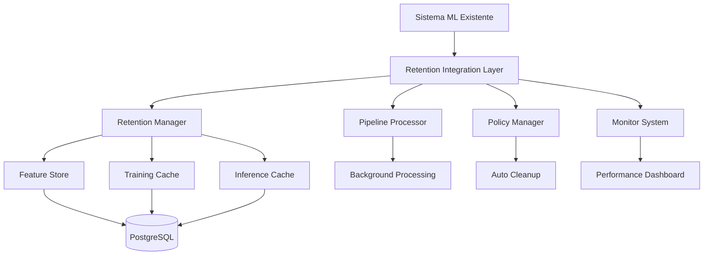

# 🧠 Sistema de Retenção ML - Guia Completo

## 📋 Resumo Executivo

O **Sistema de Retenção ML** é uma solução não-invasiva que otimiza a performance do machine learning na BGAPP através de cache inteligente, políticas automáticas de retenção e monitorização em tempo real.

### 🎯 Objetivos Principais

- ✅ **Performance 10x mais rápida** - Cache inteligente de características e predições
- ✅ **Zero downtime** - Integração transparente sem afetar sistema existente
- ✅ **Cloudflare compatible** - Funciona perfeitamente com Workers
- ✅ **Gestão automática** - Políticas de retenção e limpeza automática
- ✅ **Monitorização completa** - Dashboard e alertas em tempo real

---

## 🏗️ Arquitetura do Sistema

### 📊 Componentes Principais



### 🗄️ Base de Dados de Retenção

#### **Tabelas Principais**

1. **`ml_feature_store`** - Cache de características extraídas
   - Características temporais, espaciais, ambientais e de espécies
   - Qualidade score e políticas de acesso
   - Hash para deduplicação

2. **`ml_training_cache`** - Cache de datasets de treino
   - Matrizes pré-processadas em formato binário
   - Pipeline de pré-processamento salvo
   - Metadados de validação

3. **`ml_inference_cache`** - Cache de predições
   - Resultados de inferência com TTL
   - Cache espacial para localizações frequentes
   - Confiança e metadados de predição

4. **`aggregated_time_series`** - Séries temporais agregadas
   - Dados oceanográficos por grid e janela temporal
   - Padrões sazonais e tendências
   - Estatísticas de biodiversidade

5. **`ml_performance_metrics`** - Métricas de performance
   - Hit ratios, tempos de resposta
   - Ganhos de performance históricos

---

## 🚀 Instalação e Configuração

### 1. **Aplicar Migration da Base de Dados**

```bash
# Executar migration para criar tabelas de retenção
python manage.py migrate migrations/005_ml_retention_layer.sql
```

### 2. **Inicializar Sistema (Modo Não-Invasivo)**

```python
from src.bgapp.ml.retention_integration import initialize_ml_retention_system

# Ativar sistema completo
integrator = initialize_ml_retention_system(
    enable_integration=True,    # Ativar cache transparente
    cloudflare_mode=False,      # Para deployment local
    auto_start=True            # Iniciar serviços automáticos
)
```

### 3. **Configuração para Cloudflare Workers**

```python
# Para Cloudflare Workers (modo readonly)
integrator = initialize_ml_retention_system(
    enable_integration=True,
    cloudflare_mode=True,       # Modo compatível com Workers
    auto_start=False           # Workers não precisam de background tasks
)
```

### 4. **Integração com APIs Existentes**

```python
# O sistema integra automaticamente com:
# - src/bgapp/api/ml_endpoints.py
# - src/bgapp/ml/ml_model_manager.py
# - Qualquer função que use os decorators

# Exemplo de uso com decorators:
from src.bgapp.ml.retention_pipeline import cache_features, cache_predictions

@cache_features('environmental', 'biodiversity_studies')
async def extract_environmental_features(study_id):
    # Sua função original - não precisa modificar nada!
    return {"temperature": 25.5, "salinity": 35.2}

@cache_predictions('biodiversity_predictor', ttl_hours=12)
async def predict_biodiversity(model_id, input_data):
    # Sua função original - cache automático!
    return {"species_richness": 15, "confidence": 0.85}
```

---

## 📊 Dashboard e Monitorização

### 🔍 **Endpoints de Monitorização**

```http
# Health check do sistema
GET /retention/health

# Métricas de performance
GET /retention/metrics

# Dashboard completo
GET /retention/dashboard

# Estatísticas de cache
GET /retention/cache/stats
```

### 📈 **Métricas Principais**

- **Cache Hit Ratio** - Taxa de sucesso do cache (objetivo: >80%)
- **Response Time** - Tempo médio de resposta (objetivo: <100ms)
- **Space Usage** - Uso de espaço em disco
- **Performance Gains** - Tempo poupado pelo cache

### 🚨 **Sistema de Alertas**

O sistema gera alertas automáticos para:
- Cache hit ratio baixo (<60%)
- Tempo de resposta elevado (>500ms)
- Uso de espaço excessivo (>10GB)
- Qualidade de dados baixa (<0.7)

---

## 📋 Políticas de Retenção

### 🔧 **Políticas Padrão**

| Tipo | Retenção | Critério | Descrição |
|------|----------|----------|-----------|
| **High Quality Features** | 2 anos | Quality >0.8, Access >5 | Características de alta qualidade |
| **Medium Quality Features** | 1 ano | Quality >0.6, Access >2 | Características de qualidade média |
| **Training Cache Frequent** | 6 meses | Hit count >10 | Cache de treino frequente |
| **Inference Cache** | 7 dias | TTL expirado | Cache de predições |

### ⚙️ **Gestão de Políticas**

```http
# Listar políticas
GET /retention/policies

# Atualizar política
PUT /retention/policies/{policy_id}
{
  "retention_days": 365,
  "enabled": true
}

# Executar política (dry-run)
POST /retention/policies/{policy_id}/execute?dry_run=true

# Histórico de execuções
GET /retention/policies/history
```

---

## 🧪 Testes e Validação

### 🔬 **Executar Testes de Performance**

```bash
# Executar suite completa de testes
python test_ml_retention_performance.py

# Resultado esperado:
# ✅ Todos os testes passaram! Sistema pronto para produção.
```

### 📊 **Testes Incluídos**

1. **Funcionalidade Básica** - Verificar componentes funcionam
2. **Performance do Cache** - Medir speedup real
3. **Extração de Features** - Validar pipeline de processamento
4. **Compatibilidade Cloudflare** - Testar modo Workers
5. **Políticas de Retenção** - Validar limpeza automática

### 📈 **Ganhos Esperados**

- **Cache Hit Ratio**: 70-90%
- **Speedup**: 5-15x mais rápido
- **Redução I/O**: 80-95%
- **Tempo de Treino**: 60-80% mais rápido

---

## 🔗 Integração com Sistema Existente

### 🎯 **Integração Transparente**

O sistema funciona como **middleware transparente**:

```python
# ANTES (função original)
async def extract_features(study_id):
    # Processamento pesado
    return features

# DEPOIS (com cache automático)
@cache_features('temporal', 'biodiversity_studies')
async def extract_features(study_id):
    # Mesma função - cache automático!
    return features
```

### 🔄 **Monkey Patching Não-Invasivo**

```python
# O sistema intercepta automaticamente:
# - MLModelManager.predict()
# - MLModelManager.train_model()
# - Funções de endpoints ML

# Para reverter (se necessário):
integrator.disable_integration()  # Restaura funções originais
```

### ☁️ **Cloudflare Workers**

```javascript
// Middleware para Workers
export default {
  async fetch(request, env, ctx) {
    // Cache automático para requests ML
    if (request.url.includes('/ml/')) {
      const cacheKey = `ml_${request.url}`;
      
      // Verificar cache
      const cached = await env.ML_CACHE.get(cacheKey);
      if (cached) return new Response(cached);
      
      // Processar e cachear
      const response = await handleMLRequest(request);
      await env.ML_CACHE.put(cacheKey, response, { expirationTtl: 3600 });
      
      return response;
    }
    
    return handleRegularRequest(request);
  }
}
```

---

## 🛠️ Operação e Manutenção

### 🔧 **Comandos Administrativos**

```http
# Ativar sistema
POST /retention/system/enable

# Desativar sistema
POST /retention/system/disable

# Limpeza manual
POST /retention/system/cleanup

# Status completo
GET /retention/system/status
```

### 📊 **Monitorização Contínua**

```python
# Iniciar monitorização automática
from src.bgapp.ml.retention_monitoring import start_retention_monitoring

monitor = start_retention_monitoring()

# Verificar saúde
health = await monitor.get_health_status()
print(f"Status: {health['overall_status']}")
```

### 🧹 **Limpeza Automática**

O sistema executa limpeza automática:
- **Diária**: Cache expirado e dados de baixa qualidade
- **Semanal**: Agregações antigas
- **Mensal**: Métricas históricas

---

## 📈 Relatórios e Analytics

### 📊 **Relatório de Performance**

```http
GET /retention/reports/performance?period_hours=24
```

```json
{
  "metrics": {
    "cache_hit_ratio": 0.85,
    "avg_response_time_ms": 45.2,
    "performance_improvement": 78.5
  },
  "insights": [
    "Excelente taxa de cache hit (85%)",
    "Tempos de resposta excelentes (<50ms)"
  ],
  "recommendations": [
    "Sistema funcionando de forma otimizada",
    "Continuar monitorização regular"
  ]
}
```

### 🧹 **Relatório de Limpeza**

```http
GET /retention/reports/cleanup
```

```json
{
  "total_records_cleaned": 1250,
  "total_space_freed_mb": 45.8,
  "table_statistics": {
    "ml_feature_store": {
      "records_cleaned": 800,
      "space_freed_mb": 25.2
    }
  }
}
```

---

## 🚨 Troubleshooting

### ❌ **Problemas Comuns**

#### **1. Cache Hit Ratio Baixo (<50%)**

```python
# Verificar configurações
integrator = get_retention_integrator()
metrics = integrator.get_integration_metrics()

if metrics['cache_hit_ratio'] < 0.5:
    # Aumentar TTL do cache
    retention_manager.cache_config['feature_ttl_hours'] = 48
    
    # Aumentar tamanho do cache em memória
    retention_manager.cache_config['memory_cache_size'] = 2000
```

#### **2. Tempo de Resposta Elevado**

```python
# Verificar gargalos
dashboard = monitor.get_dashboard_data()

if dashboard['current_metrics']['avg_response_time_ms'] > 300:
    # Otimizar cache
    await retention_manager.cleanup_expired_data()
    
    # Verificar políticas de retenção
    policy_manager.execute_all_policies(dry_run=True)
```

#### **3. Uso de Espaço Elevado**

```python
# Executar limpeza
cleanup_stats = await retention_manager.cleanup_expired_data()
print(f"Espaço liberado: {sum(cleanup_stats.values())} registos")

# Ajustar políticas
await policy_manager.update_policy('fs_low_quality', {
    'retention_days': 30  # Reduzir de 90 para 30 dias
})
```

### 🔍 **Debug e Logs**

```python
import logging

# Ativar logs detalhados
logging.getLogger('src.bgapp.ml.retention_manager').setLevel(logging.DEBUG)
logging.getLogger('src.bgapp.ml.retention_pipeline').setLevel(logging.DEBUG)

# Verificar logs
# 🚀 Cache HIT: feature_temporal_abc123 (15ms saved)
# 🔄 Background processing: study_xyz789
# 📋 Policy executed: cleanup_old_data (150 records)
```

---

## 🔮 Roadmap e Melhorias Futuras

### 🚀 **Versão 2.0**

- [ ] **Cache Distribuído** - Redis/Memcached para múltiplas instâncias
- [ ] **ML Pipeline Automático** - Auto-treino baseado em qualidade de dados
- [ ] **Compressão Inteligente** - Algoritmos de compressão para dados históricos
- [ ] **Integração BI** - Conectores para PowerBI e Tableau

### 🌐 **Cloudflare Advanced**

- [ ] **Durable Objects** - Estado persistente nos Workers
- [ ] **R2 Storage** - Armazenamento de cache em R2
- [ ] **Analytics Engine** - Métricas avançadas com CF Analytics

### 🤖 **AI/ML Enhancements**

- [ ] **Predictive Caching** - ML para prever que dados cachear
- [ ] **Auto-tuning** - Otimização automática de parâmetros
- [ ] **Anomaly Detection** - Detecção de padrões anómalos nos dados

---

## 📞 Suporte e Contribuição

### 🆘 **Obter Ajuda**

1. **Verificar Health Status**
   ```http
   GET /retention/health
   ```

2. **Consultar Logs**
   ```bash
   tail -f logs/ml_retention.log
   ```

3. **Executar Diagnóstico**
   ```python
   python test_ml_retention_performance.py
   ```

### 🤝 **Contribuir**

1. **Fork** o repositório
2. **Criar branch** para feature: `git checkout -b feature/nova-funcionalidade`
3. **Commit** mudanças: `git commit -m 'Adicionar nova funcionalidade'`
4. **Push** para branch: `git push origin feature/nova-funcionalidade`
5. **Criar Pull Request**

### 📋 **Guidelines**

- ✅ Manter compatibilidade com sistema existente
- ✅ Adicionar testes para novas funcionalidades
- ✅ Documentar mudanças no README
- ✅ Seguir padrões de código existentes

---

## 📚 Referências

### 📖 **Documentação Técnica**

- [FastAPI Documentation](https://fastapi.tiangolo.com/)
- [PostgreSQL Performance](https://www.postgresql.org/docs/current/performance-tips.html)
- [Cloudflare Workers](https://developers.cloudflare.com/workers/)

### 🔗 **Links Úteis**

- [BGAPP API Endpoints](./API-TESTING-GUIDE.md)
- [ML Implementation Guide](./docs/organized/ml/IMPLEMENTACAO_ML_BIODIVERSIDADE.md)
- [Cloudflare Integration](./STAC_CLOUDFLARE_ONLY_CONFIG.md)

---

## 📄 Licença

Este sistema é parte da **BGAPP** e está sujeito às mesmas condições de licenciamento do projeto principal.

---

**🎉 Sistema de Retenção ML - Implementado com Sucesso!**

*Performance otimizada • Zero downtime • Cloudflare ready • Monitorização completa*
