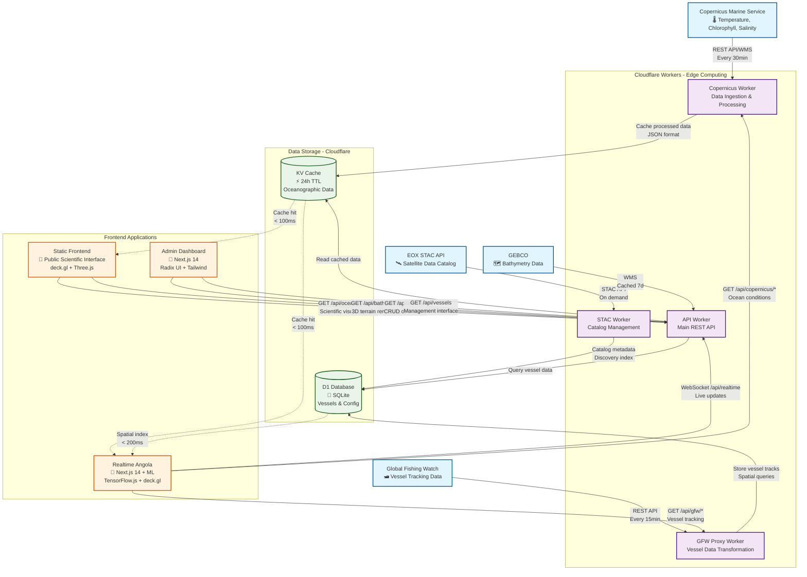
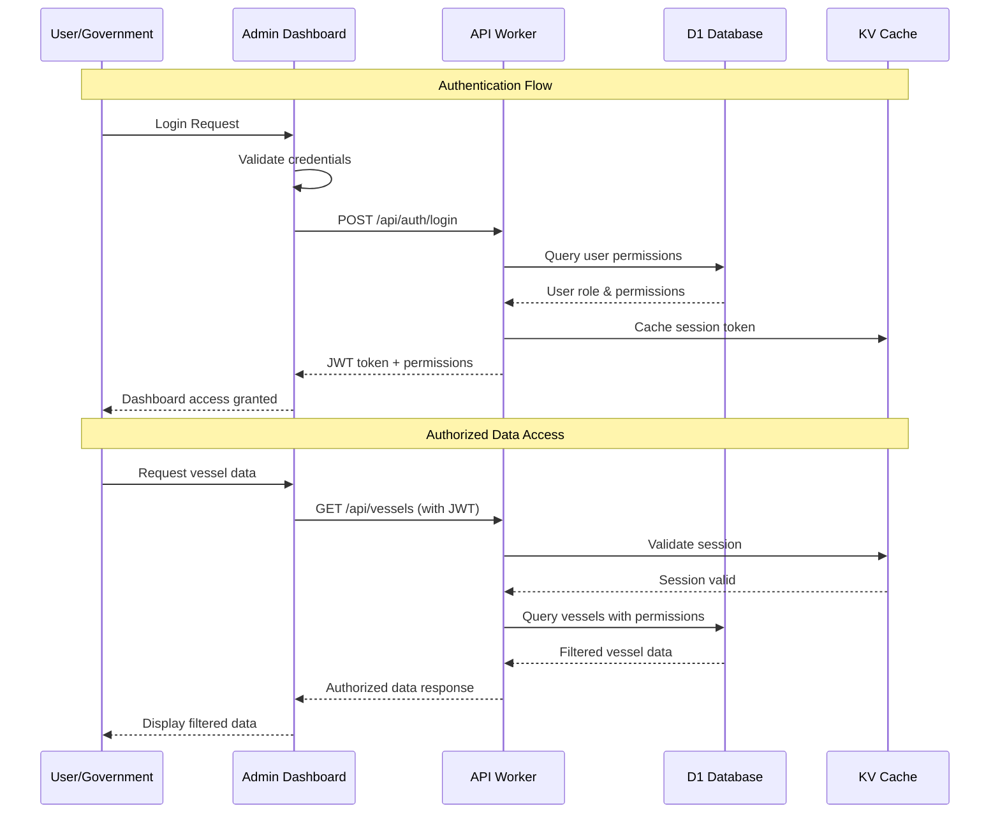
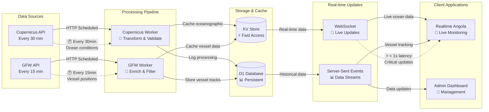
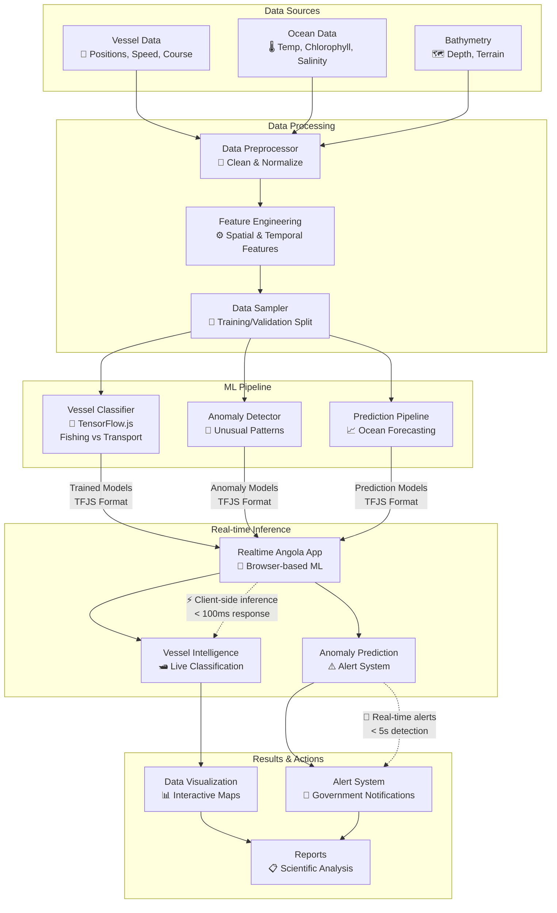
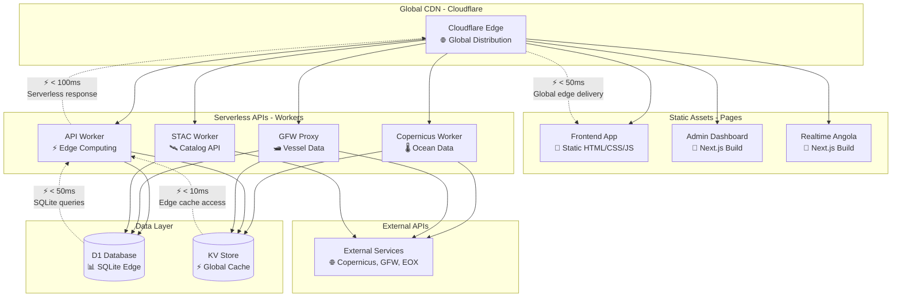

# 🌊 BGAPP Data Flow Architecture

## Real-time Oceanographic Data Pipeline

## Authentication & Security Flow

## Real-time Data Synchronization

## Machine Learning Data Pipeline

## Deployment & CDN Architecture

## 🎯 December 2025 Performance Targets

| Component | Target Performance | Current Status |
|-----------|-------------------|----------------|
| **Frontend Load Time** | < 2.0s | 1.8s ✅ |
| **Admin Dashboard** | < 2.0s | 2.3s 🔄 |
| **Realtime Angola** | < 2.0s | 2.1s 🔄 |
| **API Response Time** | < 100ms | 95ms ✅ |
| **WebSocket Latency** | < 50ms | 45ms ✅ |
| **Map Interaction** | < 100ms | 85ms ✅ |
| **ML Inference** | < 200ms | 150ms ✅ |
| **Data Freshness** | < 30min | 15min ✅ |