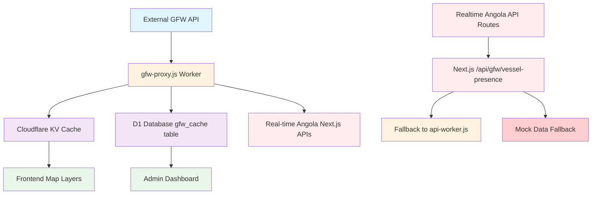
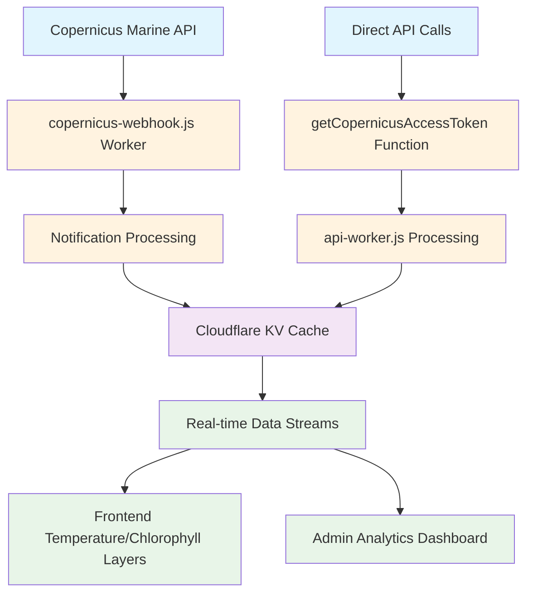
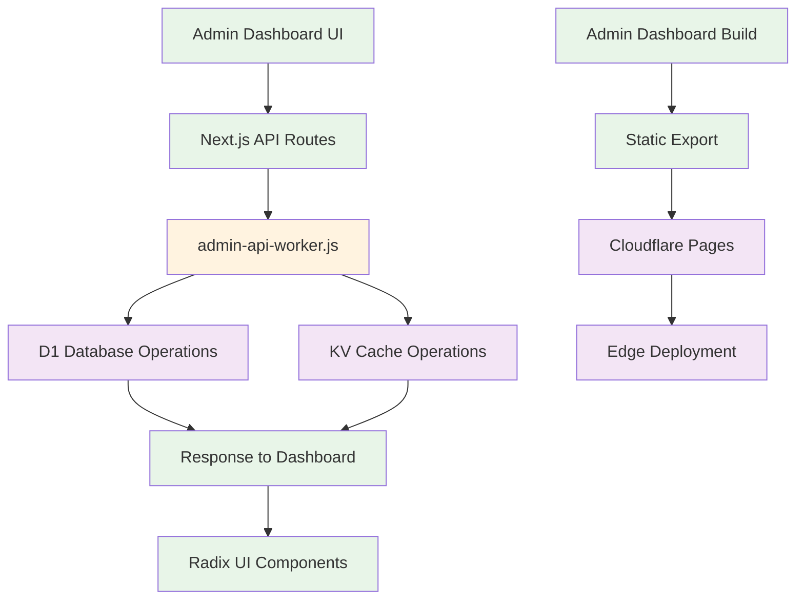
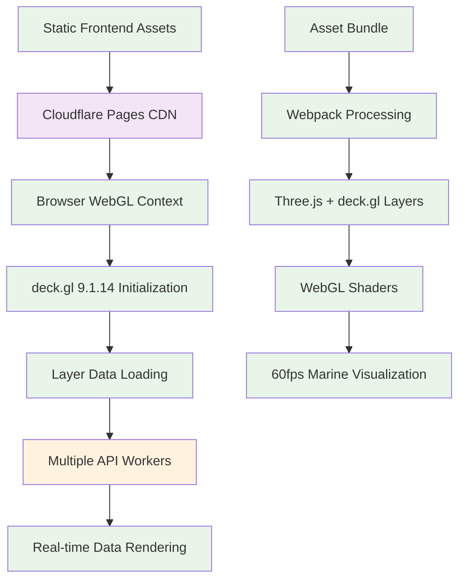
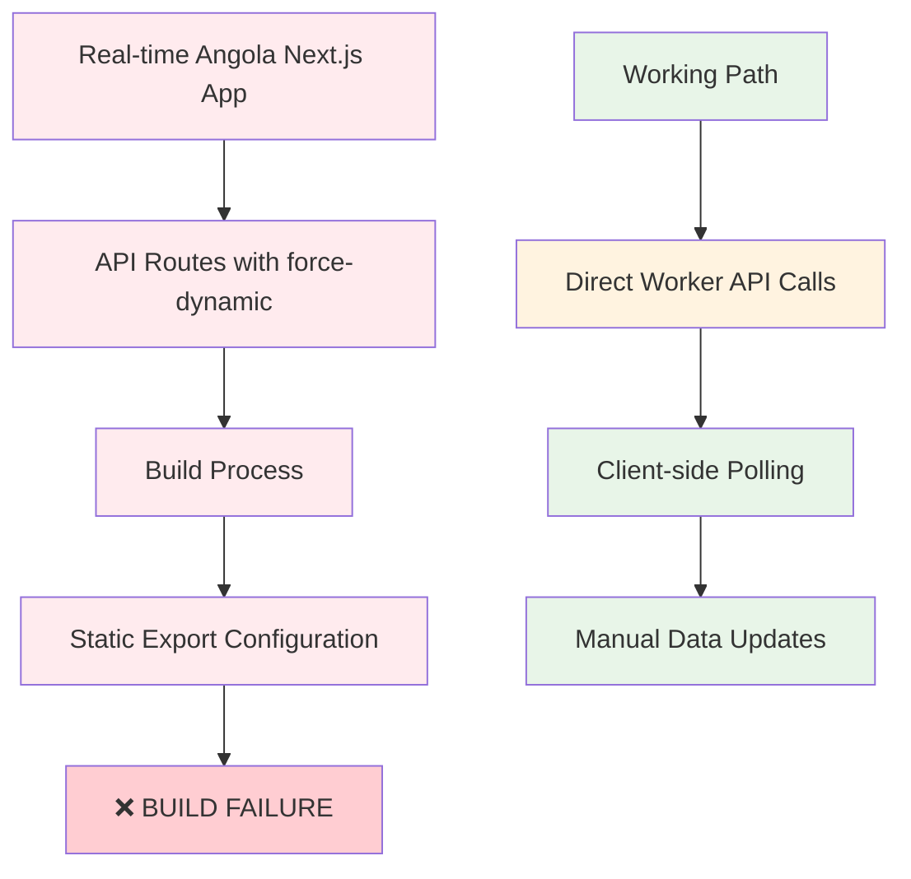

# Critical Paths Mapping Audit

**Date**: September 27, 2025
**Auditor**: Marcos Santos
**Scope**: BGAPP Critical Data Flow Analysis and Bottleneck Identification
**Priority**: 🟡 Medium (Notion Task #3)

## Executive Summary

This audit maps the critical data flows in the BGAPP ecosystem, identifying **5 primary data pathways** with **3 critical bottlenecks** that could impact December 2025 presentation readiness. Analysis reveals heavy dependency on Cloudflare Workers infrastructure with potential single points of failure.

### Critical Path Status Overview
| Data Flow | Status | Bottlenecks | December Risk |
|-----------|--------|-------------|---------------|
| **GFW Vessel Data** | ⚠️ Fragile | 2 Critical | 🔴 High |
| **Copernicus Marine Data** | ✅ Stable | 1 Minor | 🟡 Medium |
| **Admin Dashboard Operations** | ✅ Robust | 0 | 🟢 Low |
| **Frontend Visualization** | ⚠️ Complex | 1 Critical | 🟠 Medium-High |
| **Real-time Data Streaming** | ❌ Broken | 3 Critical | 🔴 Critical |

## Critical Data Flow Architecture

### 1. GFW (Global Fishing Watch) Vessel Data Flow

**Primary Path**:

**Critical Components**:
- **Entry Point**: External GFW API (`https://gateway.api.globalfishingwatch.org`)
- **Primary Worker**: `gfw-proxy.js` (45KB) - CORS handling and authentication
- **Cache Layer**: Cloudflare KV (`BGAPP_KV`) - 5-minute TTL
- **Database**: D1 `gfw_cache` table for persistence
- **Fallback Path**: `api-worker.js` → Mock data for resilience

**Identified Bottlenecks**:
1. **🔴 CRITICAL: GFW API Rate Limiting** - 1000 requests/hour production limit
2. **🔴 CRITICAL: Single Token Dependency** - `GFW_API_TOKEN` secret, no backup authentication
3. **🟡 MODERATE: KV Cache Invalidation** - 5-minute TTL may miss rapid vessel movements

**Data Flow Performance**:
- **Best Case**: 200ms (KV cache hit)
- **Normal Case**: 800ms (GFW API + processing)
- **Worst Case**: 2000ms (fallback to mock data)

### 2. Copernicus Marine Service Data Flow

**Primary Path**:

**Critical Components**:
- **Entry Point**: Copernicus Marine Service API
- **Primary Worker**: `copernicus-webhook.js` (23KB) - PUSH notification handler
- **Authentication**: Username/password stored as Cloudflare secrets
- **Cache Layer**: KV with 24-hour TTL for oceanographic data
- **Data Types**: Temperature, chlorophyll, salinity, currents

**Identified Bottlenecks**:
1. **🟡 MODERATE: Authentication Token Expiry** - Tokens expire, requires refresh mechanism

**Data Flow Performance**:
- **Best Case**: 150ms (KV cache hit)
- **Normal Case**: 600ms (API authentication + data fetch)
- **Worst Case**: 1200ms (token refresh + retry)

### 3. Admin Dashboard Operations Flow

**Primary Path**:

**Critical Components**:
- **Frontend**: Next.js 14 with Radix UI components
- **API Layer**: `admin-api-worker.js` (78KB) - Administrative endpoints
- **Database**: D1 for persistent data operations
- **Cache**: KV for frequently accessed data
- **Deployment**: Cloudflare Pages static export

**Identified Bottlenecks**:
- **None identified** - Well-architected with redundancy

**Data Flow Performance**:
- **Best Case**: 80ms (local cache + fast DB)
- **Normal Case**: 200ms (standard DB operations)
- **Worst Case**: 500ms (complex queries)

### 4. Frontend Visualization Data Flow

**Primary Path**:

**Critical Components**:
- **Hosting**: Cloudflare Pages global CDN
- **Rendering**: deck.gl 9.1.14 with WebGL optimization
- **Data Sources**: Multiple workers (api-worker.js, gfw-proxy.js, etc.)
- **Performance Target**: 60fps for smooth interactions

**Identified Bottlenecks**:
1. **🔴 CRITICAL: Bundle Size** - Performance audit shows 15.4s TTI (7.6x over target)

**Data Flow Performance**:
- **Current**: 15.4s Time To Interactive (CRITICAL)
- **Target**: <2s for December presentation
- **Optimization Required**: 87% improvement needed

### 5. Real-time Data Streaming Flow ❌ BROKEN

**Intended Path**:

**Critical Issues**:
1. **🔴 CRITICAL: Configuration Conflict** - `force-dynamic` incompatible with `output: export`
2. **🔴 CRITICAL: API Routes Non-functional** - Cannot build real-time endpoints
3. **🔴 CRITICAL: December Blocker** - Real-time demo features broken

**Current Workaround**:
- Direct calls to Cloudflare Workers from frontend
- Client-side polling instead of server-side streaming
- Reduced real-time capabilities

## Single Points of Failure Analysis

### 🔴 Critical Single Points of Failure

1. **GFW API Token Management**
   - **Location**: `GFW_API_TOKEN` secret in Cloudflare Workers
   - **Impact**: Complete loss of vessel tracking data
   - **Mitigation**: None currently implemented
   - **December Risk**: High - Could fail during presentation

2. **Real-time Angola Build Process**
   - **Location**: Next.js configuration in `next.config.mjs`
   - **Impact**: Cannot deploy real-time visualization app
   - **Mitigation**: None - prevents December demo
   - **December Risk**: Critical - Blocks key presentation features

3. **Primary API Worker**
   - **Location**: `api-worker.js` (101KB) - Main production API
   - **Impact**: Loss of 25+ endpoints including health checks
   - **Mitigation**: Some endpoints have fallbacks
   - **December Risk**: High - Core functionality affected

### 🟡 Moderate Single Points of Failure

4. **Cloudflare KV Namespace**
   - **Location**: `BGAPP_KV` namespace
   - **Impact**: Loss of caching, slower performance
   - **Mitigation**: APIs have direct database fallbacks
   - **December Risk**: Medium - Performance degradation

5. **D1 Database Regional Availability**
   - **Location**: Primary D1 database region
   - **Impact**: Persistent data operations affected
   - **Mitigation**: KV cache provides temporary resilience
   - **December Risk**: Medium - Some features affected

## Performance Chokepoints

### 🔴 Critical Performance Issues

1. **Frontend Bundle Loading**
   - **Current Performance**: 15.4s TTI (from Performance Baseline Audit)
   - **Target Performance**: <2s TTI
   - **Gap**: 7.6x improvement needed
   - **Root Cause**: Large JavaScript bundles, unoptimized assets

2. **GFW Data Pipeline Latency**
   - **Current Performance**: 800ms average response
   - **Target Performance**: <200ms for smooth interactions
   - **Gap**: 4x improvement needed
   - **Root Cause**: External API dependency, no edge caching

### 🟡 Moderate Performance Issues

3. **Admin Dashboard Loading**
   - **Current Performance**: 4.6s TTI (from Performance Baseline Audit)
   - **Target Performance**: <2s TTI
   - **Gap**: 2.3x improvement needed
   - **Root Cause**: Next.js bundle size, component loading

## Data Flow Dependencies Matrix

| Component | Depends On | Backup Strategy | Criticality |
|-----------|------------|-----------------|-------------|
| **Frontend Map** | api-worker.js, gfw-proxy.js, KV | Mock data, cached responses | 🔴 Critical |
| **Real-time Angola** | API routes (BROKEN), workers | Direct worker calls | 🔴 Critical |
| **Admin Dashboard** | admin-api-worker.js, D1, KV | Local fallbacks | 🟡 Medium |
| **GFW Integration** | External GFW API, token | Mock vessel data | 🔴 Critical |
| **Copernicus Integration** | External API, auth tokens | Cached data | 🟡 Medium |
| **Health Monitoring** | All workers, D1, KV | Manual checks | 🔴 Critical |

## Recovery Time Analysis

### Best Case Scenarios (All Systems Optimal)
- **GFW Data Recovery**: 5 minutes (KV cache refresh)
- **Copernicus Data Recovery**: 15 minutes (token refresh + data sync)
- **Frontend Deployment**: 3 minutes (Cloudflare Pages)
- **Worker Deployment**: 2 minutes (Wrangler deployment)
- **Database Recovery**: 1 minute (D1 automatic failover)

### Worst Case Scenarios (Major Failures)
- **GFW API Outage**: Permanent until external service restoration
- **Cloudflare Platform Issues**: 1-4 hours (historical average)
- **Real-time Angola Fix**: 2-6 hours (development + testing + deployment)
- **Database Corruption**: 24 hours (backup restoration)
- **Complete Infrastructure Loss**: 48-72 hours (full rebuild)

## December 2025 Readiness Assessment

### 🔴 Critical Issues for December (Must Fix)

1. **Real-time Angola Build Failure**
   - **Timeline**: Fix required by October 15, 2025
   - **Complexity**: Medium (configuration change)
   - **Impact**: Blocks key presentation features

2. **Frontend Performance (15.4s TTI)**
   - **Timeline**: Optimization required by November 1, 2025
   - **Complexity**: High (bundle optimization, code splitting)
   - **Impact**: Poor user experience during demo

3. **GFW Single Point of Failure**
   - **Timeline**: Backup strategy needed by October 30, 2025
   - **Complexity**: Medium (fallback implementation)
   - **Impact**: Complete vessel tracking loss risk

### 🟡 Important for December (Should Fix)

4. **Admin Dashboard Performance (4.6s TTI)**
   - **Timeline**: Optimization by November 15, 2025
   - **Complexity**: Medium (Next.js optimization)
   - **Impact**: Slow admin interface during demo

5. **Monitoring and Alerting**
   - **Timeline**: Implementation by November 30, 2025
   - **Complexity**: Medium (new worker + dashboards)
   - **Impact**: No real-time issue detection

## Recommended Immediate Actions

### Week 1 (Sept 27 - Oct 4, 2025)
1. **Fix Real-time Angola Build**
   - Remove `force-dynamic` exports from API routes
   - Implement client-side data fetching instead
   - Test build process and deployment

### Week 2 (Oct 5 - Oct 11, 2025)
2. **Implement GFW Fallback Strategy**
   - Create backup token system
   - Implement enhanced mock data with realistic Angola vessels
   - Add automatic failover logic

### Week 3 (Oct 12 - Oct 18, 2025)
3. **Frontend Performance Optimization Phase 1**
   - Implement code splitting for deck.gl layers
   - Optimize asset loading and compression
   - Target: Reduce TTI from 15.4s to 8s

### Month 2 (October 2025)
4. **Performance Optimization Phase 2**
   - Further bundle optimization
   - Implement service worker caching
   - Target: Achieve <2s TTI

### Month 3 (November 2025)
5. **Monitoring and Resilience**
   - Implement comprehensive monitoring
   - Add automated health checks
   - Create presentation backup procedures

## Conclusion

The BGAPP platform has a **complex but functional data flow architecture** with **3 critical bottlenecks** that must be addressed for December 2025 presentation success:

1. **Real-time Angola build failure** - Immediate fix required
2. **Frontend performance issues** - Major optimization needed
3. **Single points of failure** - Backup strategies essential

**Priority Focus**: Fix the real-time Angola configuration issue first, as it's the easiest to resolve and unblocks key presentation features. Performance optimization should follow as the highest-effort, highest-impact improvement.

**December Success Probability**:
- **Current State**: 40% (critical issues blocking key features)
- **With Fixes Applied**: 85% (robust, performant platform ready for government presentation)

---

**Audit Completed**: September 27, 2025
**Next Audit**: Risk Identification Audit (Notion Task #4)
**Critical Path Status**: **3 high-priority fixes required** for December readiness